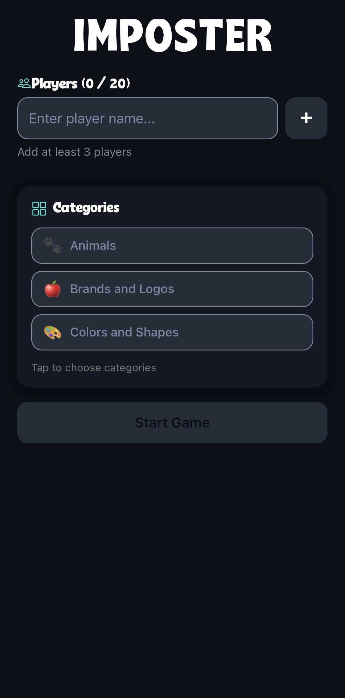
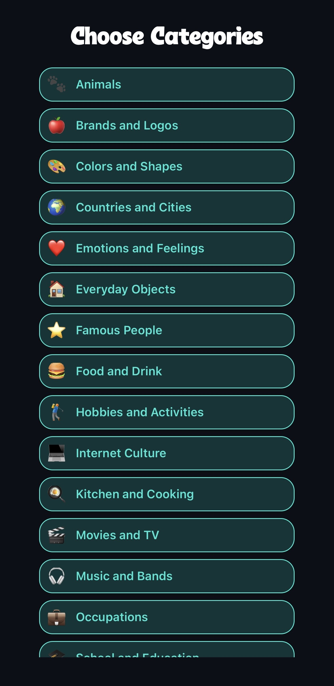

# 🎭 Imposter
**Imposter** is a fast paced party game where players must figure out who doesn't belong
Each round, players receieve a secret word... except for the **Imposter** who receieves a hint

## 🕹️ How It Works
- Players take turns giving clues related to the secret word
- The Imposter must improvise
- Discuss, vote and exposet the Imposter
- Or let the Imposter survive and win

## 🎯 Features
- Multiple fun categories
- Simple, phone-pass gameplay
- Perfect for parties, pre-drinks and game nights
- Quick rounds, easy to learn

## 📱 Built With
- React Native
- Expo

## 📸 Screenshots

  
  
  
  
  

